# Visualizations (non-normative)

This annex is **non-normative**. It mixes ASCII, Unicode, **Mermaid**, **Graphviz DOT**, **D2**, **PlantUML**, **Nomnoml**, and **inline SVG**, plus tables. **Mermaid** and **SVG** render on GitHub. **DOT** → Graphviz (`dot -Tsvg`). **D2** → [d2lang.com](https://d2lang.com). **PlantUML** → [Kroki](https://kroki.io), [plantuml.com](https://www.plantuml.com/plantuml), or IDE. **Nomnoml** → [nomnoml.com](https://nomnoml.com) (paste fenced source).

Terminology matches spec v1.1 ([05-signals-and-vocabulary](spec/05-signals-and-vocabulary.md): signal map, zone, mortality).

---

## 1. Mental model: three layers (ASCII)

```
  YOU                         THE FIELD                    THE ANTS (optional)
  ═══                         ═════════                    ═══════════════════

  goal: "tests green"    →    signals, claims      ←    sense → act → deposit
  scope: pkg/ only           repo snapshot                 (same loop, N copies)
  constraints: no API

       "I set the field"     "I watch the field"         "I don't micromanage"
```

---

## 2. Environment as shared state (ASCII)

```
                    ┌────────────────────────────────────┐
                    │           ENVIRONMENT              │
                    │  ┌──────────┐ ┌──────────┐         │
                    │  │Signal │ │  Claims  │         │
                    │  │   Map    │ │ loc→TTL  │         │
                    │  └────┬─────┘ └────┬─────┘         │
                    │       │            │               │
                    │       └──────┬─────┘               │
                    │              │                     │
                    │       ┌──────▼──────┐              │
                    │       │ RepoSnapshot│              │
                    │       │ tests, lint │              │
                    │       └─────────────┘              │
                    └────────────────────────────────────┘
                           ▲           │
              deposit      │           │ sense
              release      │           ▼
                    ┌──────┴───────────────────┐
                    │  Agent A   Agent B ...   │
                    └──────────────────────────┘
```

---

## 3. Agent loop (ASCII flow)

```
    ┌─────────┐
    │  Sense  │◄──────────────────────────────┐
    └────┬────┘                               │
         │                                    │
         ▼                                    │
    ┌─────────────┐     no target             │
    │ ChooseWork  │───────────────────────────┤
    └──────┬──────┘                           │
           │ target                           │
           ▼                                  │
    ┌─────────────┐     fail                  │
    │ TryClaim    │───────────────────────────┤
    └──────┬──────┘                           │
           │ ok                               │
           ▼                                  │
    ┌─────────────┐                           │
    │   DoWork    │                           │
    └──────┬──────┘                           │
           │                                  │
           ▼                                  │
    ┌─────────────┐                           │
    │  Deposit    │                           │
    └──────┬──────┘                           │
           │                                  │
           ▼                                  │
    ┌─────────────┐                           │
    │  Release    │───────────────────────────┘
    └─────────────┘
```

---

## 4. Termination (Mermaid)

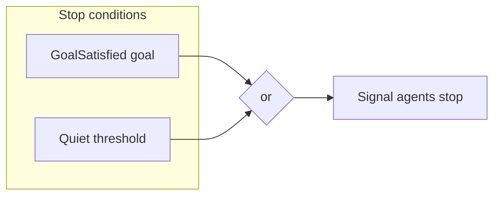

---

## 5. Meta-orchestrator outer loop (Mermaid)

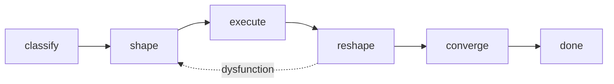

---

## 6. TUI layout (Unicode box-drawing)

```
┌─ Swarm ────────────────────────────────────────────────────────────────  [pause]
│ Goal: tests green in pkg/   Scope: pkg/     Constraints: no public API │
├─────────────────────────────────────────────────────────────────────────┤
│ ENV (hot)                    strength   claim      tests                │
│  pkg/foo.go                  ████░ needs_review  alice  FAIL            │
│  pkg/bar.go                  ██░░░ —            —       OK              │
│  pkg/baz.go                  ░░░░░ high_priority —       —              │
├─────────────────────────────────────────────────────────────────────────┤
│ Activity                                                                │
│  chose pkg/foo.go · needs_review=0.82 · no competing claim              │
│  deposited pkg/foo.go · kind=fixed · strength=0.6                       │
├─────────────────────────────────────────────────────────────────────────┤
│ Status: RUNNING · Goal: not met · Quiet: 12s · Predicates: tests, signal│
└─────────────────────────────────────────────────────────────────────────┘
```

---

## 7. Signal “map” as file tree (ASCII)

```
repo/
├── pkg/
│   ├── api.go          [review:████] [priority:██]  CLAIM bob
│   ├── core.go         [review:██░░]
│   └── util.go         [fragile:███]  do_not_change
└── cmd/
    └── main.go         [activity:█░░]
```

Legend: `█` = higher strength, `░` = lower (qualitative only).

---

## 8. Failure / recovery forks (ASCII)

```
        stuck?
          │
    ┌─────┴─────┐
    ▼           ▼
 Monitor     Human
 reshape     pause / nudge / new goal
 genome


   partial stop
        │
        ▼
  ┌─────────────┐
  │ snapshot +  │
  │ goal status │
  └──────┬──────┘
         │
   ┌─────┼─────┐
   ▼     ▼     ▼
accept reject re-seed
```

---

## 9. Authoring layers used (table)

| Layer            | Effort for AI | Good for                          | Caveat                          |
|------------------|---------------|-----------------------------------|---------------------------------|
| ASCII / Unicode  | Very low      | Loops, trees, “UI” mockups        | Alignment fragile in narrow cols|
| Mermaid          | Low           | Flowcharts, state, sequence       | Needs renderer in preview       |
| Graphviz DOT     | Medium        | Layered layouts, precise edges    | External render step            |
| D2               | Medium        | Declarative architecture sketches | `d2` CLI or playground          |
| PlantUML         | Medium–high   | Components, activities, skins     | Needs external render (Kroki)   |
| Nomnoml          | Low–medium    | Quick UML-like class diagrams       | Paste to site or embed        |
| Structurizr DSL  | Medium        | C4 containers, people             | CLI or structurizr.com          |
| Blockdiag        | Low–medium    | Nested block diagrams             | Python `blockdiag`              |
| TikZ             | High          | LaTeX / print fidelity            | `pdflatex` toolchain            |
| Inline SVG       | Medium–high   | Crisp geometry, swimlanes         | Verbose; escape `&` in text     |
| Markdown tables  | Very low      | Comparisons, legends              | Not spatial                     |
| Block quotes     | Very low      | Callouts, one-liners              | No structure                    |
| ` ```text `      | Low           | Preserve monospace spacing        | Still not true diagrams         |

---

## 10. Genome to primitives (ASCII)

```
  OrchestrationGenome          Shaper (dispatch)
  ───────────────────          ─────────────────
  topology: star        ───►   create_team / mesh
  isolation: worktree   ───►   worktree per member
  conflict: compete     ───►   arena / voting
  coordinator: central  ───►   lead / decompose
```

---

# Part B — Higher fidelity and alternate tools

## 11. Agent and environment (Mermaid sequence)

One agent turn: read shared env, mutate via claim and deposit.

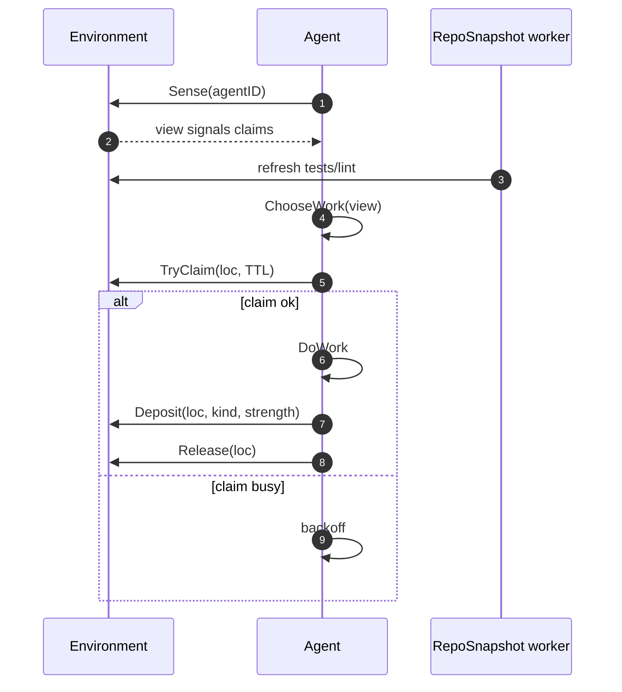

---

## 12. Swarm session lifecycle (Mermaid state)

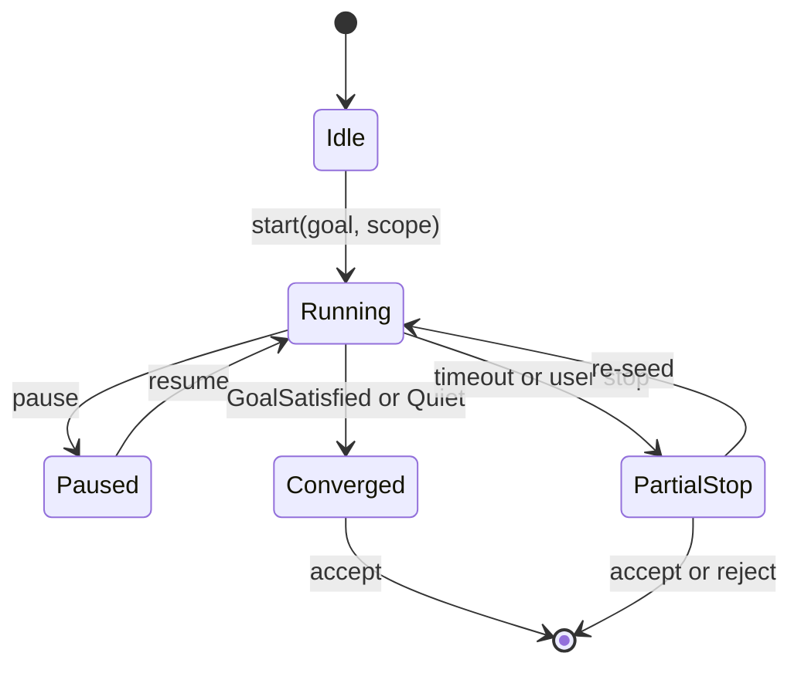

---

## 13. Classifier → Shaper → runtime (Mermaid layered)

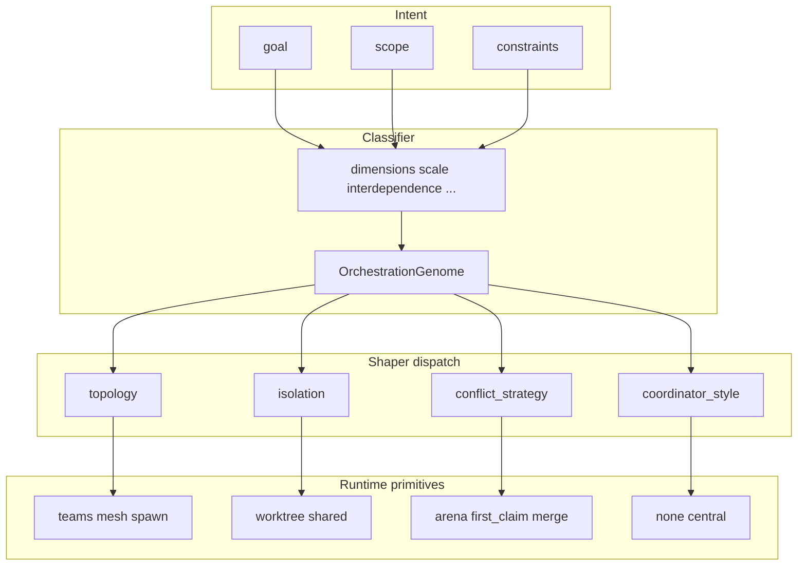

---

## 14. Environment layering (Graphviz DOT)

Render: `dot -Tsvg env-stack.dot > env-stack.svg` or use a Graphviz preview extension.

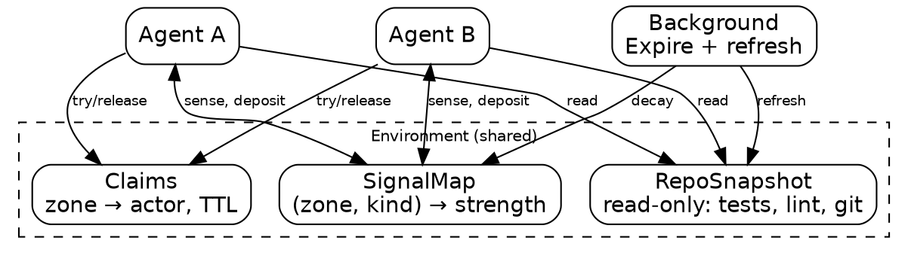

---

## 15. Data flow stack (inline SVG)

Renders in GitHub-flavored Markdown as vector graphics.

```svg
<svg xmlns="http://www.w3.org/2000/svg" viewBox="0 0 420 280" font-family="system-ui,sans-serif" font-size="11">
  <defs>
    <marker id="arrow" markerWidth="8" markerHeight="8" refX="6" refY="4" orient="auto">
      <path d="M0,0 L8,4 L0,8 z" fill="#333"/>
    </marker>
  </defs>
  <rect x="60" y="20" width="300" height="52" rx="6" fill="#e8f4fc" stroke="#1a6b9c" stroke-width="1.5"/>
  <text x="210" y="40" text-anchor="middle" font-weight="600">Intent layer</text>
  <text x="210" y="56" text-anchor="middle" fill="#333">goal · scope · constraints</text>

  <rect x="40" y="100" width="340" height="100" rx="8" fill="#f5f5f5" stroke="#666" stroke-width="1.2"/>
  <text x="210" y="118" text-anchor="middle" font-weight="600">Environment</text>
  <rect x="55" y="128" width="95" height="58" rx="4" fill="#fff" stroke="#888"/>
  <text x="102" y="150" text-anchor="middle" font-size="10">Signal</text>
  <text x="102" y="165" text-anchor="middle" font-size="10">Map</text>
  <rect x="162" y="128" width="95" height="58" rx="4" fill="#fff" stroke="#888"/>
  <text x="209" y="150" text-anchor="middle" font-size="10">Claims</text>
  <text x="209" y="165" text-anchor="middle" font-size="10">TTL</text>
  <rect x="269" y="128" width="95" height="58" rx="4" fill="#fff" stroke="#888"/>
  <text x="316" y="150" text-anchor="middle" font-size="10">Repo</text>
  <text x="316" y="165" text-anchor="middle" font-size="10">Snapshot</text>

  <rect x="130" y="228" width="160" height="40" rx="6" fill="#eef8ee" stroke="#2d6a2d" stroke-width="1.2"/>
  <text x="210" y="252" text-anchor="middle" font-weight="600">Agents N× same loop</text>

  <line x1="210" y1="72" x2="210" y2="98" stroke="#333" stroke-width="1.5" marker-end="url(#arrow)"/>
  <line x1="210" y1="200" x2="210" y2="226" stroke="#333" stroke-width="1.5" marker-end="url(#arrow)"/>
</svg>
```

---

## 16. Monitor feedback loop (D2)

Render with `d2 monitor.d2 monitor.svg` or [play.d2lang.com](https://play.d2lang.com).

```d2
direction: right

signals: {
  label: |md
    **Monitor inputs**
    task status · tokens · merges · hook exits
  |
  shape: rectangle
  style.fill: "#fff8e6"
}

monitor: {
  label: Monitor
  shape: hexagon
  style.fill: "#e6f0ff"
}

genome: {
  label: OrchestrationGenome
  shape: cylinder
  style.fill: "#f0f0f0"
}

shaper: {
  label: Shaper re-dispatch
  shape: rectangle
  style.fill: "#e8fce8"
}

signals -> monitor: observe
monitor -> genome: mutate genes
genome -> shaper: compile
shaper -> signals: changed runtime
```

---

## 17. Conformance surface (Mermaid ER-style)

Rough “entity” view of what 07-conformance requires vs optional (not a real schema).

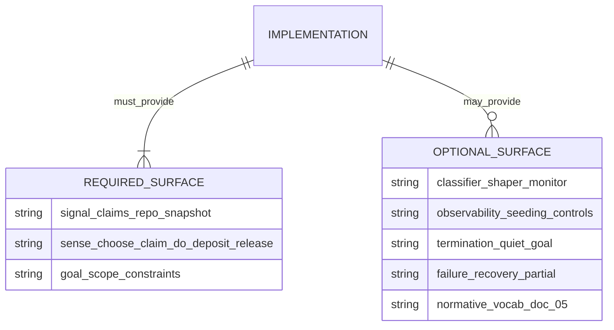

---

# Part C — Higher fidelity, more software options

## 18. System components (PlantUML)

Skinned component view: human intent, environment store, agents, optional meta-layer.

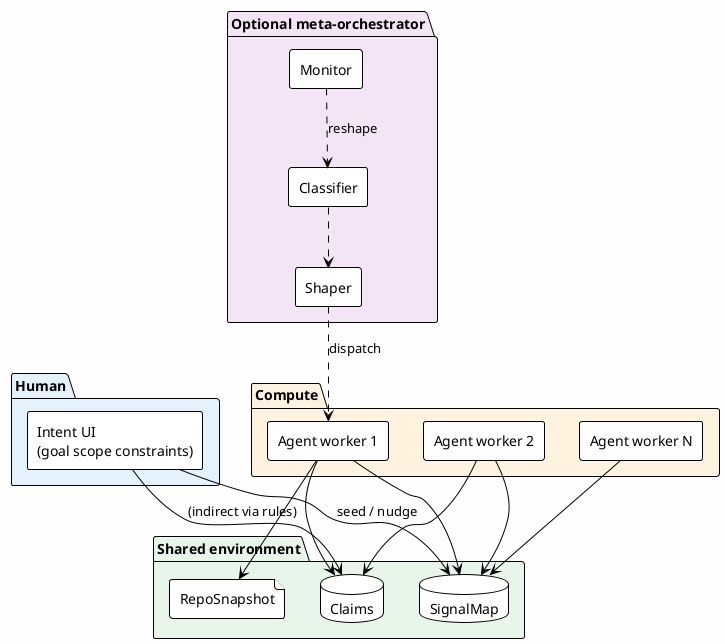

---

## 19. Agent loop as activity (PlantUML)

Swimlanes separate **Agent** vs **Environment** with explicit object flow.

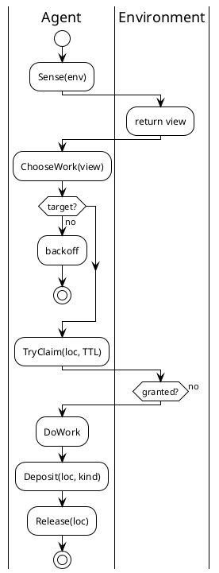

---

## 20. Core types (Nomnoml)

Paste into [nomnoml.com](https://nomnoml.com). Association-style UML sketch.

```nomnoml
#.interface: fill=#E3F2FD
#.env: fill=#E8F5E9

[<interface>Goal|
  statement
  predicates]

[<interface>Zone|
  path or symbol]

[Environment|]
[Environment] +-> [<env>SignalMap]
[Environment] +-> [<env>Claims]
[Environment] +-> [<env>RepoSnapshot]

[SignalMap| entries: Zone x Kind -> strength expires_at]
[Claims| entries: Zone -> actor expires_at]
[RepoSnapshot| tests lint git status read-only]

[Agent| id]
[Agent] --> [Environment] : sense deposit claim release
[Goal] --> [Agent] : relevance weights
```

---

## 21. Colored layered runtime (Graphviz DOT, high fidelity)

Uses `filled` nodes, `penwidth`, `splines=ortho`, and cluster `bgcolor`. Render with `dot -Tsvg`.

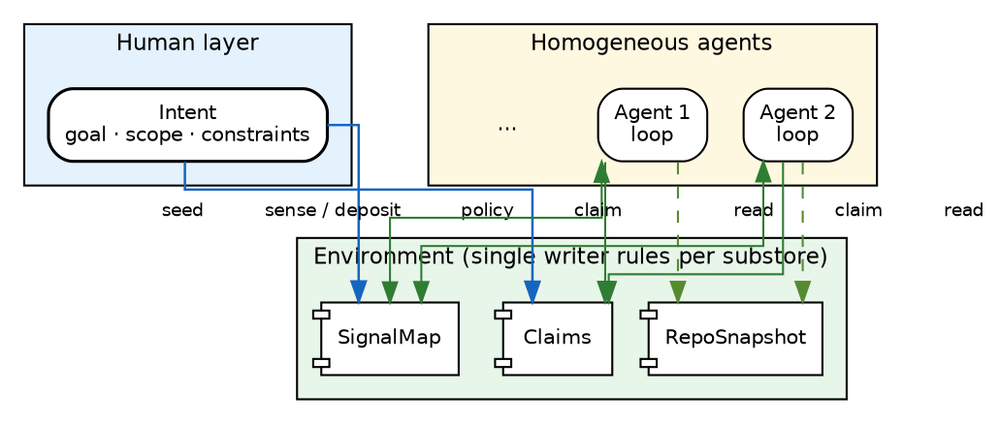

---

## 22. Domain model (Mermaid classDiagram)

Types as conceptual objects (not a programming language binding).

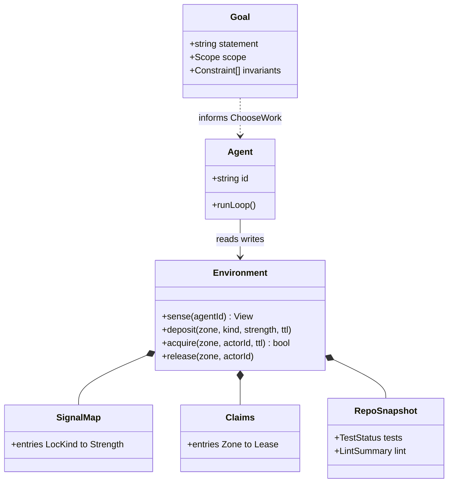

---

## 23. Parallel agents + shared strip (inline SVG swimlanes)

Three lanes under a shared **Environment** band; curved arrows suggest concurrent sense/deposit.

```svg
<svg xmlns="http://www.w3.org/2000/svg" viewBox="0 0 520 300" font-family="system-ui,sans-serif" font-size="10">
  <defs>
    <marker id="a" markerWidth="7" markerHeight="7" refX="5" refY="3.5" orient="auto">
      <polygon points="0 0, 7 3.5, 0 7" fill="#444"/>
    </marker>
    <linearGradient id="envGrad" x1="0%" y1="0%" x2="0%" y2="100%">
      <stop offset="0%" style="stop-color:#c8e6c9"/>
      <stop offset="100%" style="stop-color:#a5d6a7"/>
    </linearGradient>
  </defs>
  <rect x="20" y="16" width="480" height="44" rx="8" fill="url(#envGrad)" stroke="#2e7d32" stroke-width="1.2"/>
  <text x="260" y="32" text-anchor="middle" font-weight="700" font-size="11">Shared environment</text>
  <text x="260" y="48" text-anchor="middle" fill="#1b5e20">SignalMap · Claims · RepoSnapshot</text>
  <line x1="20" y1="72" x2="500" y2="72" stroke="#bbb" stroke-dasharray="4 3"/>

  <rect x="30" y="88" width="140" height="190" rx="6" fill="#fafafa" stroke="#999"/>
  <text x="100" y="106" text-anchor="middle" font-weight="600">Agent 1</text>
  <rect x="45" y="118" width="110" height="22" rx="3" fill="#e3f2fd" stroke="#1565c0"/>
  <text x="100" y="133" text-anchor="middle">Sense</text>
  <rect x="45" y="148" width="110" height="22" rx="3" fill="#e3f2fd" stroke="#1565c0"/>
  <text x="100" y="163" text-anchor="middle">Claim → Work</text>
  <rect x="45" y="178" width="110" height="22" rx="3" fill="#e3f2fd" stroke="#1565c0"/>
  <text x="100" y="193" text-anchor="middle">Deposit</text>

  <rect x="190" y="88" width="140" height="190" rx="6" fill="#fafafa" stroke="#999"/>
  <text x="260" y="106" text-anchor="middle" font-weight="600">Agent 2</text>
  <rect x="205" y="128" width="110" height="22" rx="3" fill="#fff3e0" stroke="#ef6c00"/>
  <text x="260" y="143" text-anchor="middle">Sense</text>
  <rect x="205" y="158" width="110" height="22" rx="3" fill="#fff3e0" stroke="#ef6c00"/>
  <text x="260" y="173" text-anchor="middle">Claim → Work</text>
  <rect x="205" y="188" width="110" height="22" rx="3" fill="#fff3e0" stroke="#ef6c00"/>
  <text x="260" y="203" text-anchor="middle">Deposit</text>

  <rect x="350" y="88" width="140" height="190" rx="6" fill="#fafafa" stroke="#999"/>
  <text x="420" y="106" text-anchor="middle" font-weight="600">Agent N</text>
  <rect x="365" y="148" width="110" height="50" rx="3" fill="#f3e5f5" stroke="#7b1fa2"/>
  <text x="420" y="168" text-anchor="middle">same loop</text>
  <text x="420" y="184" text-anchor="middle">local rules</text>

  <path d="M 100 118 Q 260 52 400 128" fill="none" stroke="#666" stroke-width="1" marker-end="url(#a)"/>
  <path d="M 100 189 Q 260 40 260 128" fill="none" stroke="#666" stroke-width="1" marker-end="url(#a)"/>
  <path d="M 260 180 Q 260 48 420 148" fill="none" stroke="#666" stroke-width="1" marker-end="url(#a)"/>
  <text x="260" y="282" text-anchor="middle" fill="#555" font-size="9">Curved arrows: concurrent read/write to shared env (ordering implementation-defined)</text>
</svg>
```

---

## 24. Meta-orchestrator pipeline (D2, styled)

More shapes and layers than §16; render with `d2 -t 400 meta_pipeline.d2 out.svg` for theme.

```d2
direction: down

title: |md
  # Adaptive meta-orchestrator (conceptual pipeline)
  | { near: top-center }

intent: {
  label: |md
    **Intent**
    goal · scope · constraints
  |
  style.fill: "#E3F2FD"
  style.stroke: "#1565C0"
  style.border-radius: 8
}

classifier: {
  label: |md
    **Classifier**
    dimensions → genome
  |
  shape: hexagon
  style.fill: "#F3E5F5"
}

genome: {
  label: |md
    **OrchestrationGenome**
    topology · isolation · conflict · coordinator
  |
  shape: cylinder
  style.fill: "#EEEEEE"
}

shaper: {
  label: |md
    **Shaper**
    dispatch to primitives
  |
  style.fill: "#E8F5E9"
}

runtime: {
  label: |md
    **Runtime**
    teams · worktrees · arena · spawn
  |
  style.fill: "#FFF8E1"
}

monitor: {
  label: |md
    **Monitor**
    OODA · mutate genes
  |
  shape: oval
  style.fill: "#FFEBEE"
}

intent -> classifier
classifier -> genome
genome -> shaper
shaper -> runtime
runtime -> monitor: signals
monitor -> genome: reshape
```

---

## 25. Tooling quick reference (table)

| Software        | Typical use here              | Fidelity   | Render path                          |
|-----------------|-------------------------------|------------|--------------------------------------|
| Mermaid         | Flow, sequence, state, class  | Medium     | GitHub, Mermaid Live                 |
| Graphviz DOT    | Clusters, ortho edges, color  | High       | `dot`, Kroki                         |
| D2              | Icons, themes, layers         | High       | `d2` CLI, play.d2lang.com            |
| PlantUML        | Components, activities        | High       | Kroki, plantuml.com, IDE             |
| Nomnoml         | Class sketches                | Medium     | nomnoml.com                          |
| Structurizr DSL | C4 containers, people         | High       | Structurizr CLI, structurizr.com       |
| Blockdiag       | Nested groups, quick SVG      | Medium     | `blockdiag` Python pkg               |
| TikZ            | Publications, precise layout  | Very high  | `pdflatex`, Overleaf                 |
| Inline SVG      | Swimlanes, gradients, precise | Very high  | Browser / GitHub MD                  |

---

## 26. C4-style containers (Structurizr DSL)

Text-first architecture-as-code. Render with [Structurizr CLI](https://github.com/structurizr/cli) or [structurizr.com](https://structurizr.com) (free workspace). Higher fidelity than Mermaid for **container** boundaries.

```dsl
workspace {

    model {
        u = person "Developer"
        s = softwareSystem "Swarm orchestration" {
            intent = container "Intent" "Goal, scope, constraints"
            env = container "Environment" "SignalMap, Claims, RepoSnapshot"
            agents = container "Agents" "N homogeneous loops"
            intent -> env "seed, nudge"
            agents -> env "sense, claim, deposit, release"
        }
        u -> intent "configures"
    }

    views {
        container s {
            include *
            autoLayout lr
        }
    }

}
```

---

## 27. Nested blocks (Blockdiag)

Python [blockdiag](https://blockdiag.com/): `blockdiag file.diag -o out.svg`. Good for simple nested groupings.

```blockdiag
blockdiag {
  default_fontsize = 11;
  orientation = portrait;

  group env {
    label = "Environment";
    color = "#E8F5E9";
    PM [label = "SignalMap"];
    CL [label = "Claims"];
    RS [label = "RepoSnapshot"];
  }
  A1 [label = "Agent 1"];
  A2 [label = "Agent 2"];
  A1 -> PM [dir = both];
  A2 -> PM [dir = both];
  A1 -> CL;
  A2 -> CL;
}
```

---

## 28. Print-quality diagram (TikZ, LaTeX)

For PDF papers or books. Compile with `pdflatex` (needs `\usepackage{tikz}` and `\usetikzlibrary{positioning}`).

```latex
\begin{tikzpicture}[
  node distance=8mm and 12mm,
  box/.style={draw, rounded corners, minimum width=2.8cm, minimum height=8mm, align=center, font=\small}]
  \node[box, fill=blue!12] (I) {Intent\\[-2pt]\scriptsize goal · scope};
  \node[box, fill=green!15, below=of I] (E) {Environment};
  \node[box, fill=orange!12, below left=of E] (A1) {Agent 1};
  \node[box, fill=orange!12, below right=of E] (A2) {Agent 2};
  \draw[->, thick] (I) -- (E);
  \draw[->, thick] (E) -- (A1);
  \draw[->, thick] (E) -- (A2);
  \draw[->, thick] (A1) to[bend left=25] node[right, font=\scriptsize] {deposit} (E);
  \draw[->, thick] (A2) to[bend right=25] node[left, font=\scriptsize] {sense} (E);
\end{tikzpicture}
```
